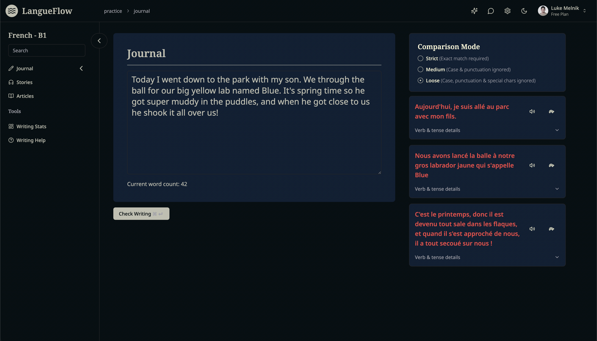
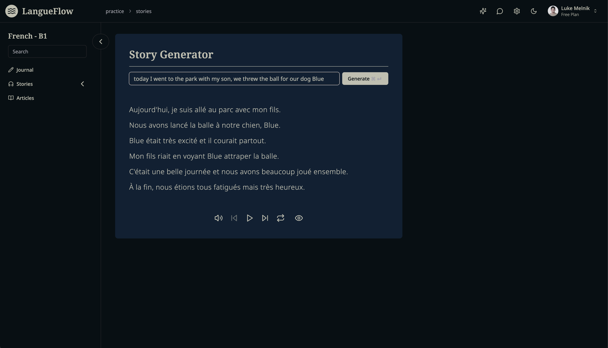
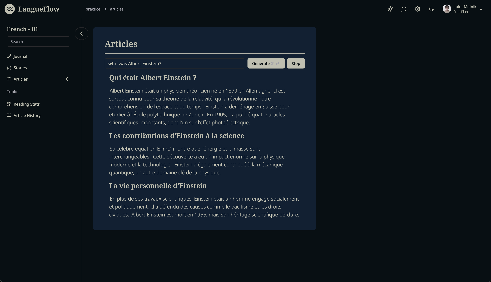

LangueFlow was a language-learning app built around comprehensible input and the Natural Approach rather than quizzes or rote study. It let learners read, listen, and journal about their own lives so the language felt relevant, contextual, and low-stress.

It was an early project, but a useful one. The core idea still feels right; in hindsight, the bigger question is whether the web was the right surface for it.

## Problem

Most language apps optimize for streaks, quizzes, and gamified repetition. That can keep people engaged, but it does not always help them acquire a language in a natural way.

I wanted something closer to real language acquisition:

- understandable input instead of drills
- low-stress interaction
- writing tied to real life instead of generic prompts
- vocabulary that would actually matter to the learner

The journal feature came directly from that last point. Writing about your own day is more useful than rehearsing generic phrases.

## Solution

LangueFlow combined three practice modes:

- **Journal:** write about your own life and get language-aware feedback
- **Stories:** generate short narrative content with phrase-level help
- **Articles:** explore topics in the target language through follow-up reading

The goal was to make reading, listening, and writing reinforce each other without falling back to classroom-style exercises.

## What I built

- A Next.js web app centered on journaling, stories, and articles.
- AI-assisted journal correction and phrase analysis.
- Story generation broken into phrases with translations, proficiency estimates, and register metadata.
- Article generation that could continue through follow-up prompts instead of stopping at a single response.
- Phrase-level popovers so learners could get help without leaving the reading flow.
- Audio generation and playback for generated content.

What I liked most about the concept was that it kept learning tied to the learner's actual life rather than a generic curriculum.

## Technical architecture

The app was built with:

- **Frontend:** Next.js, React, Tailwind
- **Client state:** Zustand
- **API and server-state fetching:** tRPC with TanStack React Query
- **Backend:** Drizzle, PostgreSQL, NextAuth
- **AI layer:** OpenAI for journal correction, story generation, article generation, translation, and audio
- **Storage/infrastructure:** Cloudflare R2 for generated audio, plus Docker, GitHub Actions, GHCR, and Traefik for deployment

One of the most useful backend decisions was organizing the code into domain-oriented vertical slices. Instead of scattering logic across generic layers, I kept schemas, repositories, routers, and services aligned to domains like journal, story, article, audio, and language content.

On the frontend, this project was also where I got a much better feel for state boundaries. Zustand worked well for local and persistent UI state like journal text and settings, while React Query was the right place for server state and async fetching. Learning that distinction made the app simpler and became a pattern I reused later.

That structure also became useful later when working with AI agents. When the code for a feature lived together, it was easier for agents to find the right context and make fewer mistakes.

## Product decisions

The main product bet was philosophical as much as technical: avoid quiz-heavy language learning and focus on comprehensible input.

That led to a few decisions:

- prioritize reading, listening, and writing over drill mechanics
- make journaling central so vocabulary stays personally relevant
- surface translations and explanations inline instead of interrupting the flow
- use AI to adapt content difficulty and provide context on demand

In hindsight, the fixed Journal / Stories / Articles structure was both useful and limiting. It was a clear way to package the idea at the time, but newer models and real-time voice interfaces make me think a more adaptive product shape would be better now.

## Current status

LangueFlow was live as a web app, but it never really caught on. One of the clearest takeaways was that this type of experience probably fits mobile better than web.

I still believe in the core learning idea. I am less convinced by the exact interface layer it shipped with.

## What I learned

- The biggest product lesson was to trust the principles of comprehensible input: lean on what feels natural in language acquisition rather than rebuilding the rigid structure of traditional education.
- Prompting was hard to dial in. Small prompt changes could shift the output a lot, and the models at the time were much less reliable about structured output, which mattered because the UI depended on phrase-by-phrase metadata.
- Frontend state boundaries matter. LangueFlow was where I learned the difference between local client state and server state, and why Zustand and React Query solve different problems.
- Code organization matters, especially once AI is involved. Vertical domain slices made later feature work faster and less error-prone.
- A good product idea can still be packaged in the wrong surface. This project made me more skeptical of forcing a web-first UI onto something that may want to be mobile, voice-first, or more adaptive overall.
