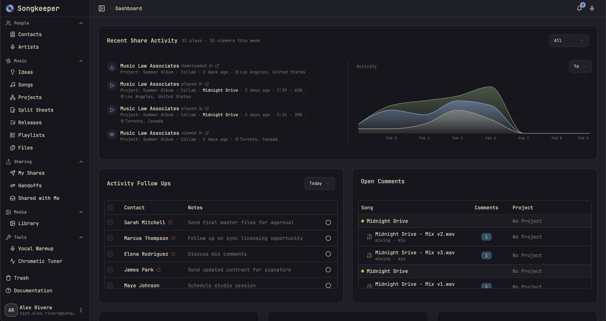
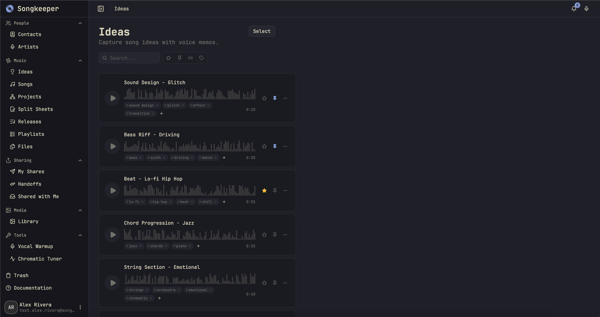
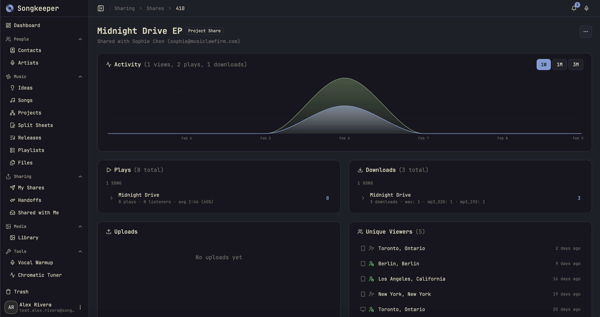
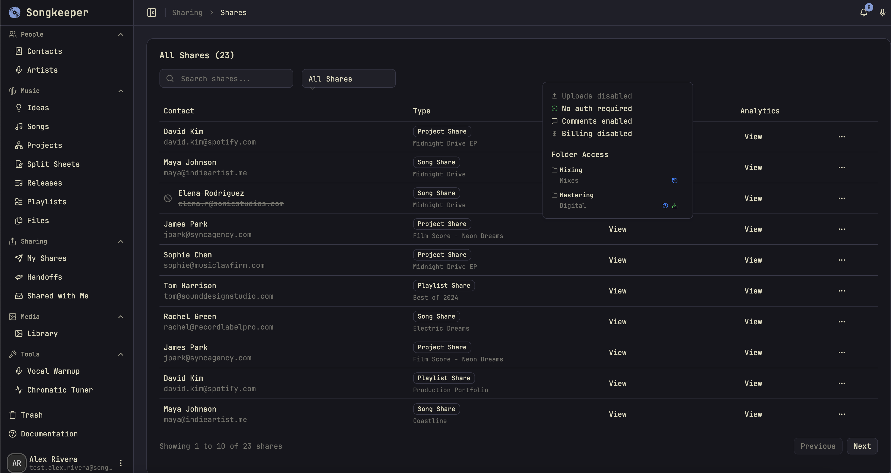

Songkeeper is a music production management platform for producers, mixers, engineers, and artists, available across web, desktop, and iOS. It combines project storage, industry metadata, collaboration tools, and release-admin workflows in one place. The product is live at [songkeeper.io](https://songkeeper.io) with testers, and I am currently focused on optimization, user feedback, and royalty-body export.

## Problem

Most music project management tools solve only the file-storage part of the workflow.

- Competing tools often behave like a music-themed Dropbox: useful for uploading files, but disconnected from the metadata and business processes around those files.
- Music projects require more than storage:
  - ISWC codes for compositions
  - ISRC codes for recordings
  - split sheets and ownership information
  - voice memos and early song ideas
  - multiple recordings of the same composition
  - mix and master revisions
  - export-ready data for collection societies like SOCAN and SoundExchange
- Those details are often scattered across folders, spreadsheets, voice memo apps, email threads, and royalty portals.
- The result is duplicated data entry, inconsistent organization, and important admin work getting delayed until after the creative process.

## Solution

Songkeeper treats music metadata and workflow structure as first-class parts of the product.

- Work with the same catalog across web, desktop, and iOS.
- Store and organize project files in a consistent structure.
- Track the relationship between songs, recordings, mixes, masters, collaborators, credits, and ownership.
- Keep voice memos and ideas connected to the rest of the project instead of isolated in a separate app.
- Share music with collaborators and clients while tracking listening activity.
- Prepare the same metadata for downstream release and royalty-registration workflows.

## What I built

- A multi-platform product for managing songs, recordings, collaborators, files, and metadata across web, desktop, and iOS.
- A web app for the full management workflow, an Electron desktop app, an iOS app for mobile access and idea capture, and a CLI for automation.
- A structured project model that separates:
  - **Song** — the composition / intellectual property
  - **Recording** — a specific performance or production of that song
  - **Files** — the artifacts created through the production process
- A consistent file structure organized by recording phases, so demos, sessions, stems, mixes, masters, artwork, and marketing assets are easier to track.
- A file classification system for recording, mixing, mastering, and asset files.
- Collaboration and sharing tools, including:
  - listen tracking
  - shared playlists that update when new mixes are uploaded
  - one-click access revocation
  - download utilities that keep the highest-quality WAV as the source of truth
- Voice memo support that keeps early ideas in the same system as the finished project, including offline-capable capture on iOS.
- A CLI designed for automation and agent use, with machine-readable command discovery, JSON output, dry-run support, field projection, pagination, and IDs-only modes.
- API-backed release data so new releases can automatically appear on my website when they are added in Songkeeper.

## Technical architecture

Songkeeper is a monorepo with several product surfaces:

- **Web app:** TanStack Start, TanStack Router, TanStack Query, TanStack Form, TanStack Table, React, Tailwind, shadcn/ui
- **API:** Hono, tRPC v11, Better Auth
- **Database:** PostgreSQL with Drizzle ORM
- **Desktop:** Electron
- **iOS:** SwiftUI
- **CLI:** TypeScript CLI built with Commander and compiled into native binaries with Bun; designed to be scriptable and agent-accessible through explicit command discovery and machine-safe flags
- **Tooling:** Turborepo, pnpm, Vitest, Playwright, oxlint, oxfmt
- **Infrastructure:** Docker with Traefik as the reverse proxy on a self-hosted server
- **Media/storage:** Backblaze B2 for object storage, with Cloudflare for CDN and image delivery

The architecture is intentionally domain-heavy. Instead of treating every upload as a generic file, Songkeeper models the actual concepts used in music production and music rights administration.

## Product decisions

### Opinionated organization

There is no universal industry standard for organizing music project files. Songkeeper imposes a consistent structure so each project follows the same pattern.

That decision has a few benefits:

- producers do not need to reinvent folder conventions for every project
- collaborators receive projects in a predictable format
- files can be classified by their role in the production process
- future agentic workflows can reason about files because the product understands what they are

### Progressive complexity

The hardest product challenge has been deciding how much music-industry complexity to show upfront.

Songkeeper supports a detailed model:

- a song can have multiple recording versions
- each recording can have its own credits, ownership, and metadata
- recordings can move through mix and master revisions
- split and royalty information can follow industry conventions

That model is accurate, but it can overwhelm new users. I initially exposed multi-recording-version creation more prominently, then moved it deeper into the interface. The capability is still available, but it no longer forces novice users to understand composition-versus-recording distinctions on the first screen.

## Agent-assisted development

Songkeeper has been built with significant AI-agent assistance, but not as an unstructured "generate code" workflow.

The parts that made agents useful:

- strong automated gates: type checks, linting, formatting, and tests
- type-aware oxlint rules to catch more issues during agent iterations
- Chrome DevTools MCP for frontend verification
- direct server-log access for debugging runtime issues
- detailed repo instructions and consistent implementation patterns
- a CLI intentionally designed for agents and automation, including `songkeeper commands` for machine-readable command discovery

The main lesson: codebase consistency directly affects agent output. Agents repeat the patterns they see. Dead code, duplicated approaches, and inconsistent abstractions make agent work less predictable, so cleanup became part of the development infrastructure rather than a cosmetic task.

## Current status

- Public and live with testers.
- Focused on optimization and feedback rather than broad feature expansion.
- Recent scope cleanup removed or de-emphasized features that were not central to the product.
- Major feature in progress: royalty-body export.

The royalty export work is meant to reduce a recurring administrative pain point: after finishing a song, rights holders often have to enter the same metadata into several different collection-society systems. Songkeeper already has much of that structured data, so the next step is generating CSV or Excel exports tailored to bodies like SOCAN and SoundExchange.

## What I learned

- Building from lived experience helped identify workflow problems that are easy to miss from the outside.
- The file-storage problem is only one layer; the more valuable problem is connecting storage to metadata, ownership, collaboration, and release administration.
- Accurate domain modeling is useful, but it has to be introduced gradually in the UI.
- AI assistance can accelerate development, but it also makes feature creep easier. I added some features because more felt better, then pared the product back after realizing focus made it stronger.
- Clean architecture, consistent patterns, and automated checks are especially important when agents are part of the development process.
